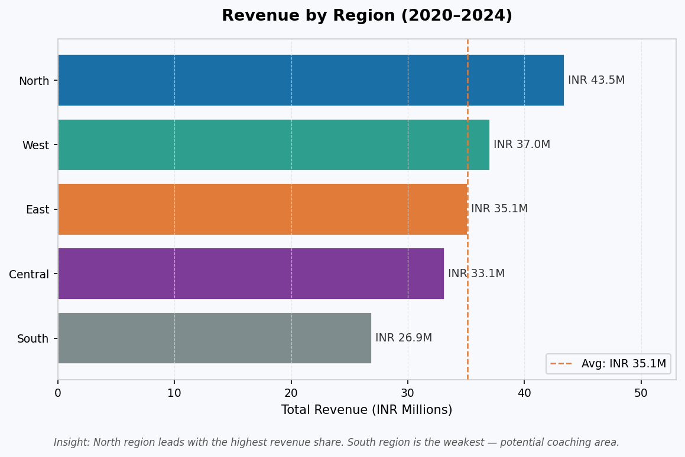
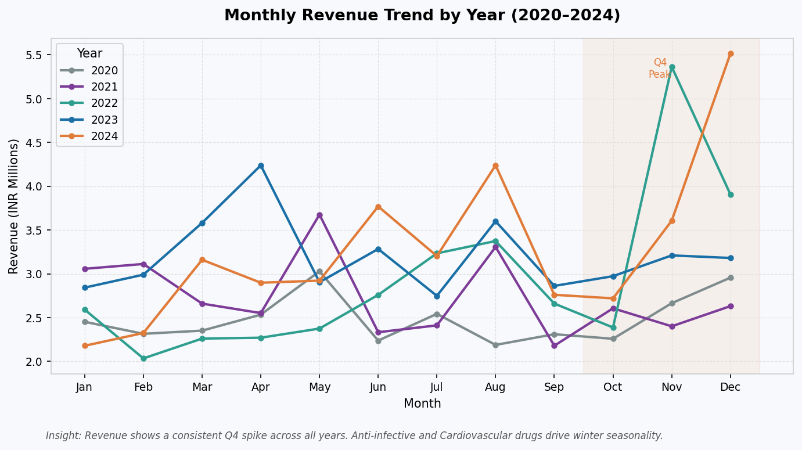
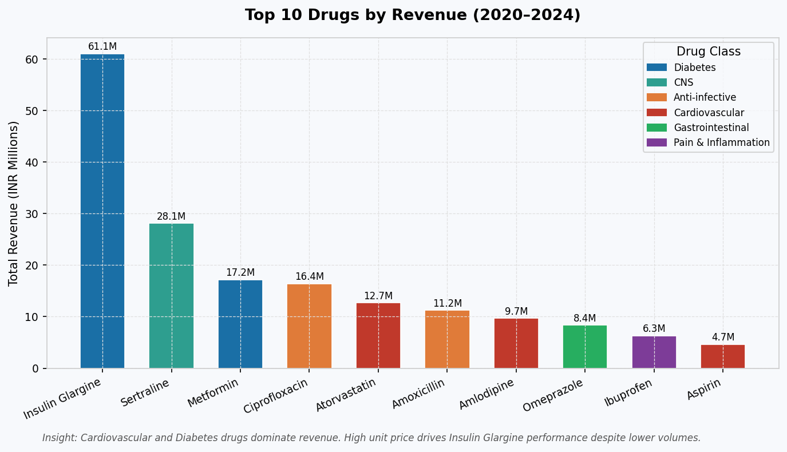
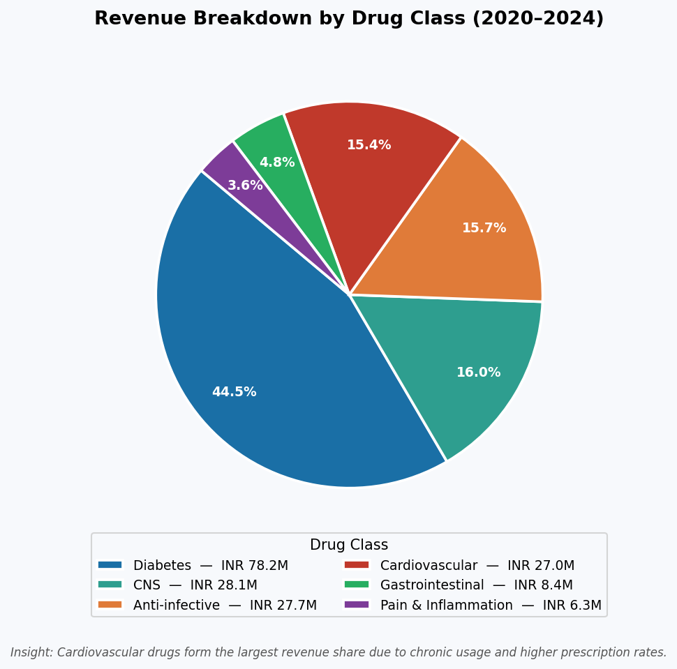
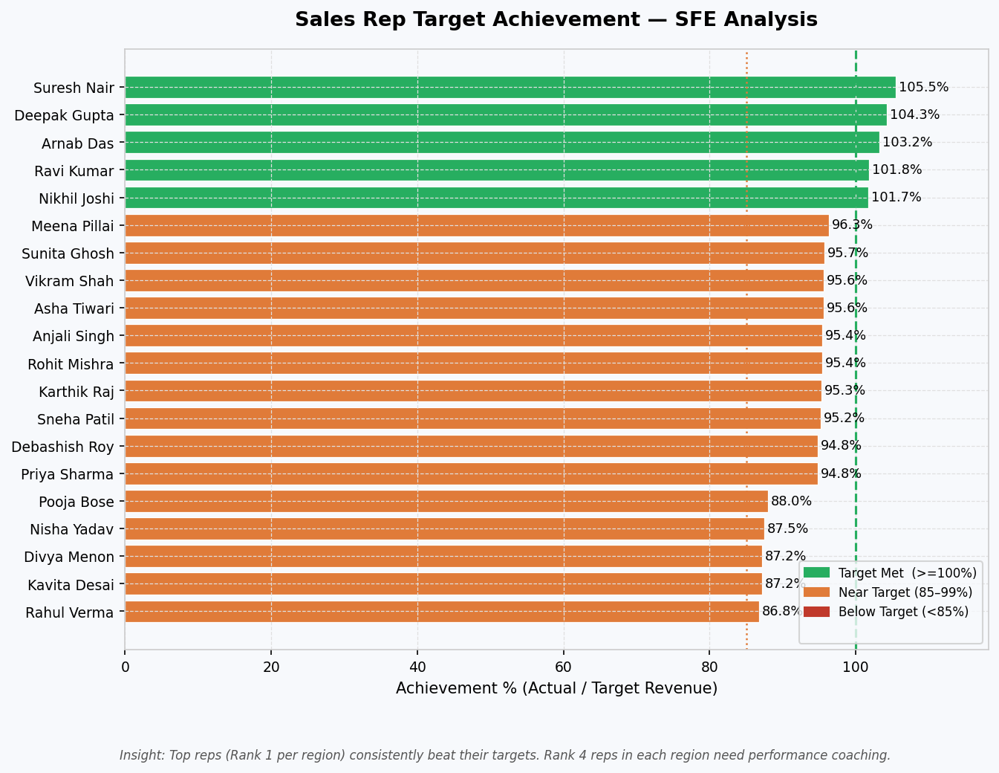
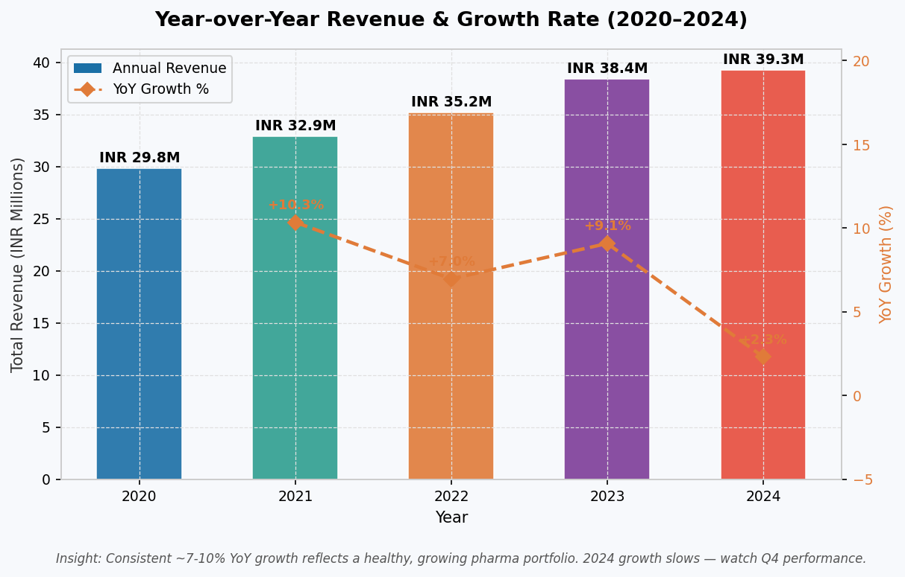

# Pharmaceutical Sales Analytics


---

## Project Overview

This project simulates the kind of **end-to-end data analytics solution** that ZS Associates builds for pharmaceutical clients. It covers a complete analytics pipeline:

```
Data Generation → Data Cleaning → SQL Analysis → Visualizations
   Phase 1           Phase 2         Phase 3         Phase 4
```

### Dataset
- **5,000 transactions** across 5 years (2020–2024)
- **10 drugs** across 6 ATC drug classes
- **5 regions**: North, South, East, West, Central
- **20 sales reps** (4 per region) with realistic performance tiers
- **2 channels**: Hospital (40%) | Pharmacy (60%)
- **Total Revenue**: INR 17.6 Crore

---

## Tech Stack

| Layer | Technology |
|-------|-----------|
| Data Generation | Python — NumPy, Pandas |
| Data Cleaning | Python — Pandas, NumPy (IQR, median imputation) |
| SQL Analysis | SQLite — CTEs, Window Functions |
| Visualization | Python — Matplotlib, Seaborn |
| Database | SQLite (star schema) |

---

## Project Structure

```
pharmaceuticalsalesanalytics/
│
├── 📁 data/
│   ├── generate_data.py          ← standalone data generator
│   ├── pharma_sales.csv          ← raw dataset (5,010 rows with dirty data)
│   └── pharma_sales_clean.csv    ← cleaned dataset (5,000 rows)
│
├── 📁 scripts/
│   ├── 01_generate_data.py       ← Phase 1: synthetic data generation
│   ├── 02_clean_data.py          ← Phase 2: cleaning pipeline
│   ├── 03_sql_analysis.py        ← Phase 3: SQL query execution
│   └── 04_visualizations.py      ← Phase 4: chart generation
│
├── 📁 sql/
│   ├── schema/
│   │   └── 01_create_tables.sql  ← SQLite DDL with indexes
│   └── analysis/
│       ├── 02_region_sales.sql   ← GROUP BY + aggregate functions
│       ├── 03_top_drugs.sql      ← CTE + DENSE_RANK() window
│       ├── 04_monthly_growth.sql ← CTE + LAG() window
│       ├── 05_rep_performance.sql← CTE + CASE WHEN + RANK() window
│       └── 06_quarterly_summary.sql ← CTE + SUM() OVER() cumulative
│
├── 📁 reports/figures/
│   ├── chart1_revenue_by_region.png
│   ├── chart2_monthly_trend.png
│   ├── chart3_top_drugs.png
│   ├── chart4_drug_class_pie.png
│   ├── chart5_rep_achievement.png
│   └── chart6_yoy_growth.png
│
├── INTERVIEW_PREP.md             ← detailed study guide
├── requirements.txt
└── README.md
```

---

## How to Run

### 1. Install dependencies
```bash
pip install -r requirements.txt
```

### 2. Run all phases in order
```bash
# Phase 1 — Generate synthetic dataset + SQLite DB
python scripts/01_generate_data.py

# Phase 2 — Clean data (nulls, duplicates, outliers)
python scripts/02_clean_data.py

# Phase 3 — Run all 5 SQL queries
python scripts/03_sql_analysis.py

# Phase 4 — Generate all 6 charts
python scripts/04_visualizations.py
```

---

## Phase 1 — Data Generation

**Script**: `scripts/01_generate_data.py`

Generates a realistic synthetic pharma dataset using:
- **NumPy** for controlled randomness (`np.random.seed(42)` for reproducibility)
- **Seasonal multipliers** per drug class (e.g., Anti-infectives peak in winter)
- **Regional multipliers** (North 20% above average, South 20% below)
- **Rep performance tiers** — Pareto effect (top rep = 1.5x, bottom = 0.7x)
- **YoY growth** of ~10% built in (2020–2024)
- **Intentional dirty data**: 20 nulls, 15 nulls, 5 outliers, 10 duplicates

```
Output:
  data/pharma_sales.csv    → 5,010 rows × 15 columns (632 KB)
  data/pharma_sales.db     → SQLite database (fact_sales table)
```

---

## Phase 2 — Data Cleaning

**Script**: `scripts/02_clean_data.py`

| Issue | Count | Treatment | Why |
|-------|-------|-----------|-----|
| Duplicate rows | 10 | `drop_duplicates()` | Double-counted revenue |
| Missing `units_sold` | 20 | Median by drug_class | Median robust to outliers |
| Missing `unit_price` | 15 | Median by drug_name | Context-aware imputation |
| Outliers (IQR method) | 5 | `np.clip()` capping | Preserve row, fix value |

```python
# Outlier detection — IQR method
q1, q3 = df['units_sold'].quantile([0.25, 0.75])
iqr = q3 - q1
df['units_sold'] = np.clip(df['units_sold'], q1 - 1.5*iqr, q3 + 1.5*iqr)
```

```
Output:
  data/pharma_sales_clean.csv  → 5,000 rows (10 dupes removed, 0 nulls)
  data/pharma_sales.db         → fact_sales_clean table added
```

---

## Phase 3 — SQL Analysis

**Script**: `scripts/03_sql_analysis.py`  
**Database**: `data/pharma_sales.db` → table `fact_sales_clean`

All SQL files are in `sql/analysis/`. Executed from Python using `sqlite3` + `pd.read_sql_query()`.

### SQL Concepts Demonstrated

| Query | Business Question | Key SQL |
|-------|------------------|---------|
| `02_region_sales.sql` | Which regions drive most revenue? | `GROUP BY`, `SUM`, `AVG`, subquery |
| `03_top_drugs.sql` | Top 3 drugs per region? | CTE + `DENSE_RANK() OVER (PARTITION BY)` |
| `04_monthly_growth.sql` | Month-over-month growth trend? | CTE + `LAG() OVER (ORDER BY)` |
| `05_rep_performance.sql` | Which reps hit their targets? (SFE) | CTE + `CASE WHEN` + `RANK() OVER` |
| `06_quarterly_summary.sql` | Are we on track YTD? | CTE + `SUM() OVER (PARTITION BY year)` |

### Sample — Top Drugs per Region (CTE + DENSE_RANK)
```sql
WITH drug_revenue AS (
    SELECT region, drug_name, drug_class,
           ROUND(SUM(revenue), 2) AS total_revenue
    FROM fact_sales_clean
    GROUP BY region, drug_name, drug_class
),
ranked_drugs AS (
    SELECT *,
        DENSE_RANK() OVER (
            PARTITION BY region
            ORDER BY total_revenue DESC
        ) AS rank_in_region
    FROM drug_revenue
)
SELECT region, rank_in_region AS rank, drug_name, total_revenue
FROM ranked_drugs
WHERE rank_in_region <= 3
ORDER BY region, rank_in_region;
```

### Sample — Month-over-Month Growth (LAG)
```sql
WITH monthly AS (
    SELECT year, month, ROUND(SUM(revenue), 2) AS monthly_revenue
    FROM fact_sales_clean
    GROUP BY year, month
)
SELECT year, month, monthly_revenue,
    LAG(monthly_revenue) OVER (ORDER BY year, month) AS prev_month_revenue,
    ROUND(
        (monthly_revenue - LAG(monthly_revenue) OVER (ORDER BY year, month))
        * 100.0 / LAG(monthly_revenue) OVER (ORDER BY year, month), 2
    ) AS mom_growth_pct
FROM monthly;
```

---

## Phase 4 — Visualizations

**Script**: `scripts/04_visualizations.py`  
**Output**: `reports/figures/` (6 PNG charts)

### Chart 1 — Revenue by Region


### Chart 2 — Monthly Revenue Trend (All Years)


### Chart 3 — Top 10 Drugs by Revenue


### Chart 4 — Drug Class Market Share


### Chart 5 — Sales Rep Target Achievement (SFE)


### Chart 6 — Year-over-Year Revenue Growth


---

## Key Business Insights

| Insight | Finding |
|---------|---------|
| **Top Region** | North — INR 43.5M (24.7% of total revenue) |
| **Weakest Region** | South — INR 26.9M (15.3%), needs sales strategy review |
| **Top Drug** | Insulin Glargine — INR 61M (high price = revenue despite volume) |
| **Seasonality** | Q4 (Oct–Dec) peaks across all years — Anti-infective & Cardio drugs |
| **YoY Growth** | Consistent 7–10% annually, 2024 slowing (monitoring needed) |
| **SFE** | 5/20 reps hit 100%+ target; Rank-1 reps in every region consistently win |

---

## Pharma Domain Concepts Used

| Term | Meaning |
|------|---------|
| **SFE** | Sales Force Effectiveness — measuring rep performance vs. targets |
| **TRx** | Total Prescriptions — proxy: `units_sold` |
| **NRx** | New Prescriptions — new patient count |
| **ATC** | Anatomical Therapeutic Chemical — WHO drug classification |
| **Channel** | Hospital vs. Pharmacy — where the drug is dispensed |
| **Territory** | Geographic area assigned to a sales rep |

---

## Requirements

```
pandas>=2.0.0
numpy>=1.24.0
matplotlib>=3.7.0
seaborn>=0.12.0
openpyxl>=3.1.0
```

> **Note**: `sqlite3` is part of Python's standard library — no installation needed.

---

